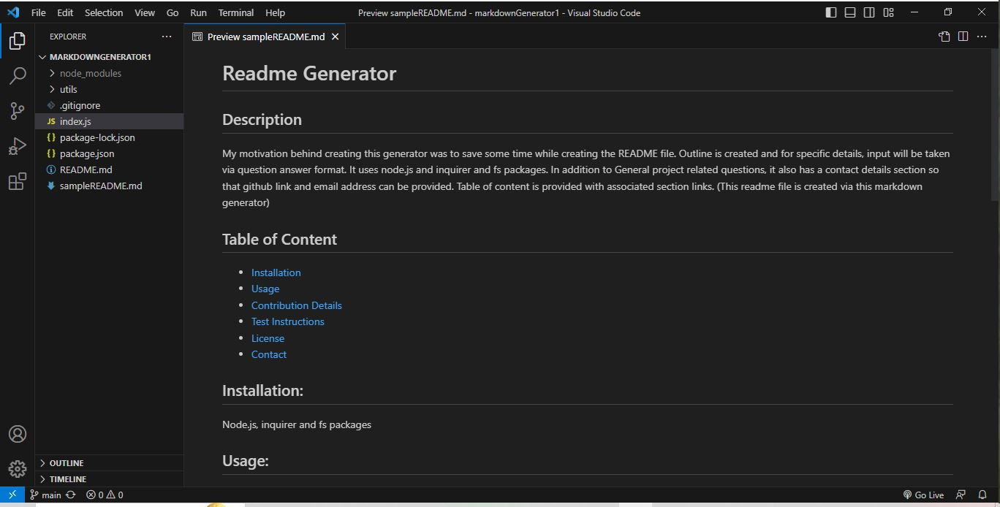

# README Generator
  ## Description
  My motivation behind creating this generator was to save some time while creating the README file. Outline is created and for specific details, input will be taken via question answer format. It uses node.js and inquirer and fs packages. In addition to General project related questions, it also has a contact details section so that github link and email address can be provided. Table of content is provided with associated section links.  Below is the link for sample readme file.

  ## Sample README link:
  https://github.com/Nehaps29/markdownGenerator1/blob/main/sampleREADME.md

  ## Short Video Link showing how it is generated: 
  https://drive.google.com/file/d/1WDDvmC99J4mKM3RN1tItwwO_GleqC0qI/view?usp=drive_link

  It looks like below image:

  ## Table of Content

  - [Installation](#installation)
  - [Usage](#usage)
  - [Contribution Details](#contribution-details)
  - [Test Instructions](#test-instructions) 
  - [License](#licenses)
  - [Contact](#contact)
  
  

  ## Installation: 
  node.js, inquirer and fs packages
  ## Usage:
  use to generator readme file
  ## Contribution Details: 
  Neha Sabannavar, Rutgers TA, https://gist.github.com/lukas-h/2a5d00690736b4c3a7ba
  ## Test Instructions: 
  none

  ## Licenses: 
  MIT
      
  https://opensource.org/licenses/MIT 

  
  ## Contact: 
  Below mentioned is my github profile link 

  ## Github: https://github.com/nehaps29
 
